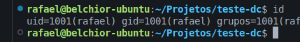

# Teste DC — Cadastro de vendas e personalização de parcelas

Aplicação web em **Laravel 12** para cadastro de **clientes**, registro de **vendas** (itens, forma de pagamento e parcelas), **login** com vendedor vinculado à venda, **filtros** na listagem e **exportação do resumo em PDF**. Interface com **Bootstrap 5** e **jQuery** (CDN).

## Requisitos

- Docker version 29.3.0

## Instalação e passo a passo para rodar o projeto

Clone o repositório:

```bash
git clone https://github.com/rafPH1998/teste_dc.git
```

Entre na pasta do projeto:

```bash
cd teste_dc
```

Acesse o projeto:

```bash
code .
```

Crie o Arquivo .env:

```bash
cp .env.example .env
```

Ajuste o **`.env`** OBS: (Por ser um projeto de teste, abaixo esta as credencias do env):

```env
DB_CONNECTION=mysql
DB_HOST=db
DB_PORT=3306
DB_DATABASE=teste_dc
DB_USERNAME=root
DB_PASSWORD=root
```

Suba os containers do projeto:

```bash
docker compose up -d
```

Caso gere um erro de permissao, é importante que o ID seja o mesmo que está definido no Dockerfile:




Acessar o container:

```bash
docker compose exec app bash
```

Instale as dependências PHP:

```bash
composer install
```

Configure o ambiente:

```bash
php artisan key:generate
```

Rode as migrations com o seed de demonstração:

```bash
php artisan migrate:fresh --seed
```

O seed cria usuário demo, formas de pagamento, produtos de exemplo e dados auxiliares.

## Acessar projeto

```bash
http://localhost:8001/login
```

### Login de demonstração

| Campo   | Valor                 |
|---------|-----------------------|
| E-mail  | `vendedor@teste.local` |
| Senha   | `senha123`            |


## Estrutura principal

- **Rotas:** `routes/web.php`
- **Controllers:** `app/Http/Controllers/`
- **Services (regras de negócio):** `app/Services/` — classes `*Service`
- **Models:** `app/Models/`
- **Views:** `resources/views/`
- **Logo:** `public/logo-dc/logo-dc.png`

## PDF

O resumo da venda usa **DomPDF** (`barryvdh/laravel-dompdf`). A rota `GET /vendas/{id}/pdf` exibe o PDF no navegador (somente vendas do usuário logado).

